# DayZ Server Manager

[](https://go.dev)
[](LICENSE.md)
[](#)

**Author:** Aristarh Ucolov — © 2026. All rights reserved.

---

# RU

**DayZ Server Manager** — один exe-файл, который кидается в папку DayZ Server
и превращает обычный сервер в удобную панель управления в браузере. Никаких
`Notepad`, никаких `.bat` — всё через приятный веб-интерфейс. Вдохновлён
панелями хостингов GTA SA:MP.

<p align="center">
  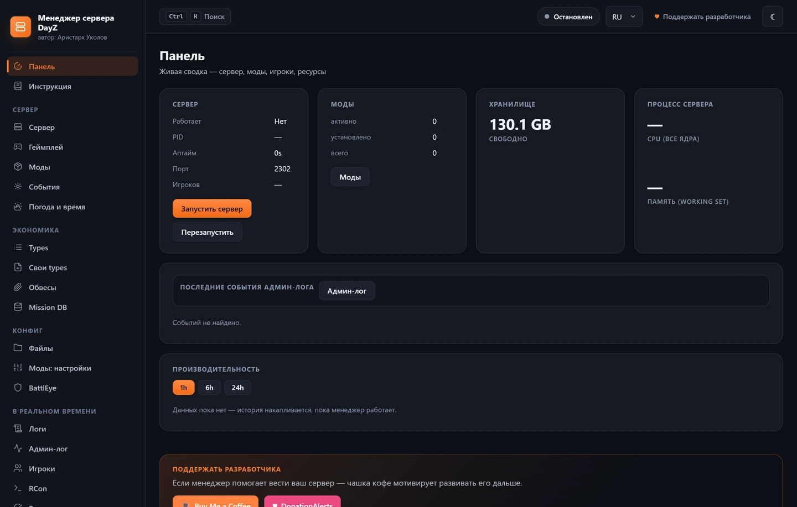
</p>

<table>
  <tr>
    <td width="50%">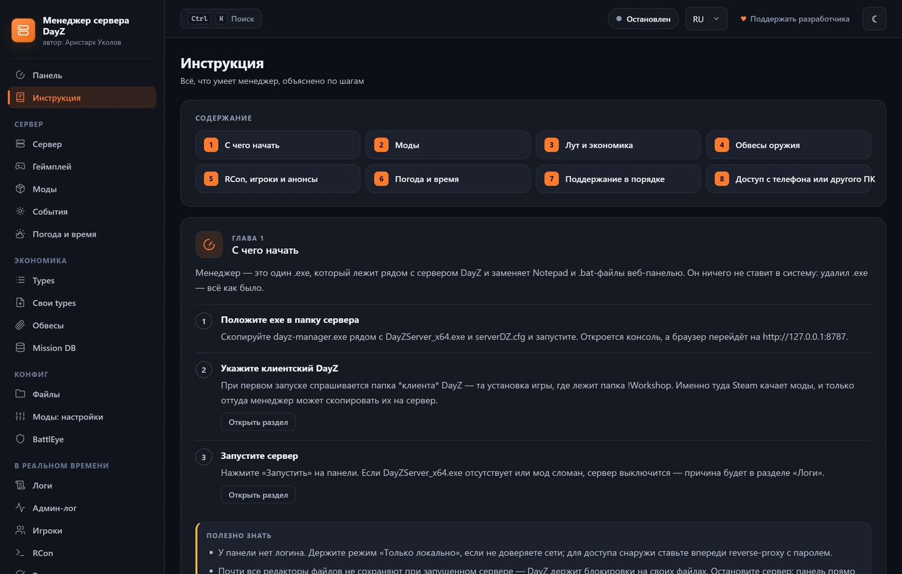<br>
      <b>Инструкция</b> — восемь глав с пошаговыми объяснениями, скриншотом раздела и переходом прямо в нужную страницу</td>
    <td width="50%">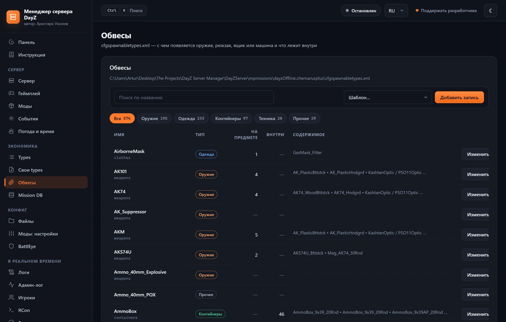<br>
      <b>Обвесы</b> — cfgspawnabletypes.xml с реальными процентами спавна вместо сырых весов</td>
  </tr>
  <tr>
    <td>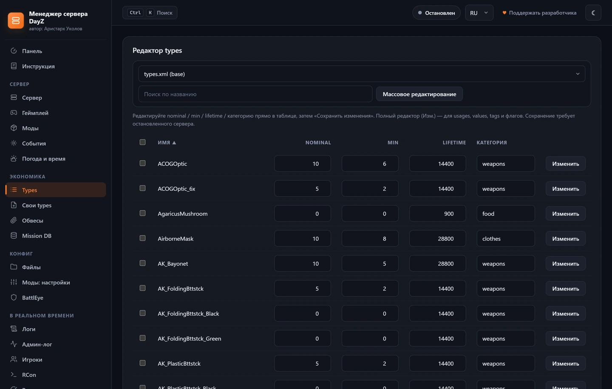<br>
      <b>Лут</b> — types.xml с поиском, правкой прямо в таблице и массовыми заготовками</td>
    <td>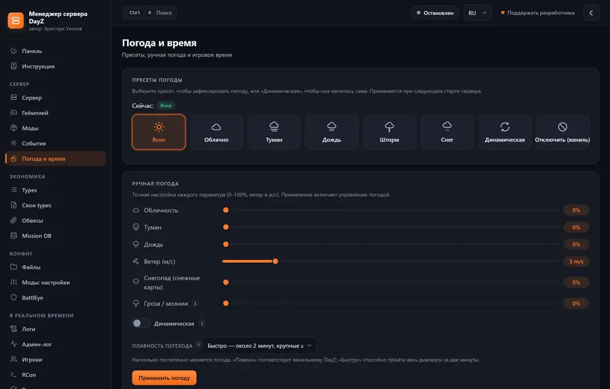<br>
      <b>Погода</b> — пресеты, ручная настройка и плавность перехода</td>
  </tr>
  <tr>
    <td>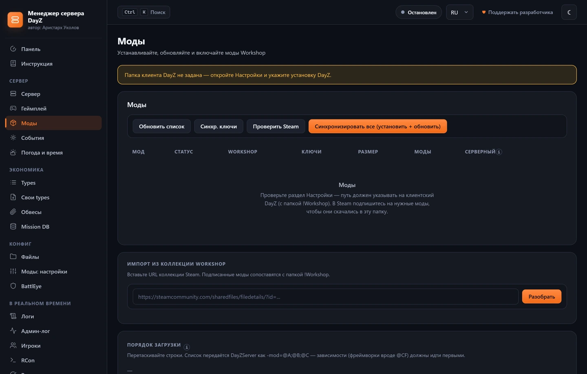<br>
      <b>Моды</b> — установка из !Workshop, ключи, порядок загрузки, авто-обновление</td>
    <td>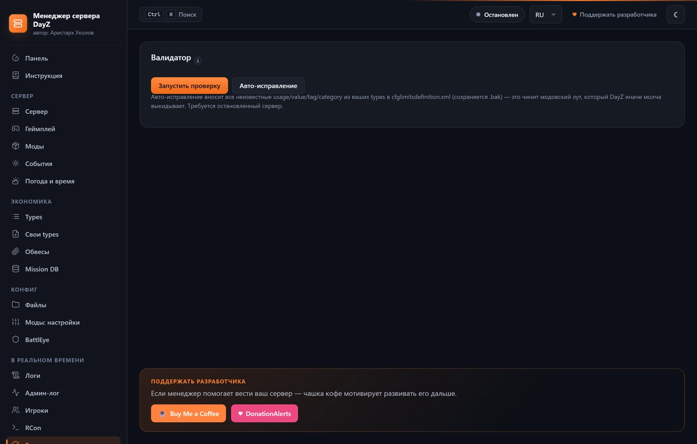<br>
      <b>Валидатор</b> — проверка XML, ссылок между файлами и значений с авто-исправлением</td>
  </tr>
</table>

## Что умеет

- **Заменяет стандартный .bat.** Запускает `DayZServer_x64.exe` с теми же
  параметрами (port, cpuCount, BEpath, profiles, -mod, -serverMod,
  dologs/adminlog/netlog/freezecheck, опционально filePatching) + опциональный
  авто-рестарт по интервалу.
- **Установка и обновление модов из Steam !Workshop.** Один раз указываешь
  путь к своему клиентскому DayZ — дальше в UI видишь все `@Моды`, которые
  Steam закачал. Жмёшь **Install** — мод копируется в папку сервера, а все
  `.bikey` автоматически переносятся в `keys/`. Жмёшь **Update** —
  перезаливается из Workshop (атомарно: новая версия ставится во временную
  папку и только потом подменяет старую, так что поломанное обновление не
  убивает сервер). Есть **Update all outdated** и **Sync all** — привести
  папку сервера в соответствие с `!Workshop` одним кликом.
- **Авто-обновление модов.** Можно обновлять моды перед каждым рестартом и
  периодически проверять `!Workshop` — если подписанный мод там новее,
  сервер обновится и перезапустится с обычным обратным отсчётом.
- **Watchdog.** Если сервер упал сам — менеджер поднимет его через
  10 секунд. Защита от crash-loop (3 падения за 5 минут) приостанавливает
  авто-рестарты и показывает баннер с кнопкой «Возобновить».
- **Уведомления Discord.** События сервера (запуск, краш, рестарты,
  обновления модов, бэкапы) отправляются в канал Discord через вебхук —
  на языке панели.
- **Порядок загрузки и серверные моды.** Порядок `-mod=` меняется
  перетаскиванием (зависимости вроде `@CF` — первыми). Отдельный тумблер для
  серверных модов (`-serverMod=`).
- **Безопасное удаление модов.** При удалении мода ключи из `keys/`
  удаляются только если **ни один другой установленный мод** не использует
  тот же `.bikey`. Shared-ключи типа `dayzexpansion.bikey` (CF/Core/AI
  делят его) остаются на месте, пока хоть один компонент стоит.
- **Редактор server.cfg в браузере.** Сохраняет комментарии и `class`-блоки
  round-trip (твой форматинг не ломается). Одним полем меняется карта
  (`template=`) — например `dayzOffline.chernarusplus` → `dayzOffline.enoch`.
- **Редактор types.xml.** Таблица с поиском, инлайн-правка `nominal`, `min`,
  `lifetime`, `category` прямо в таблице + полный редактор каждого объекта:
  `restock`, `quantmin/max`, `cost`, `flags`, `usages`, `values`, `tags`.
- **Заготовки спавнов (spawn presets).** Встроенный набор: Military Tier 3/4,
  Civilian, Industrial, Hunting, Rare. Выделяешь объекты → жмёшь заготовку →
  её `usage/value/tag` и настройки спавна применяются ко всем выбранным.
- **Редактор событий (events).** Таблицы спавна зомби, машин, хеликрашей:
  `nominal/min/max/lifetime/restock`, дочерние элементы.
- **Свои types (moded_types).** Создаёшь новый файл своих types; манагер
  **автоматически** вписывает его в `cfgeconomycore.xml`. Можно
  импортировать `*_types.xml` прямо из установленного мода.
- **Редактор обвесов (cfgspawnabletypes.xml).** Задаёшь, с чем спавнится
  оружие: магазин, прицел, приклад, цевьё — слотами с вероятностями.
  Панель показывает **реальный шанс** каждого предмета (шанс слота × вес ÷
  сумма весов) — в сыром XML это легко прочитать неверно. Есть шаблоны
  популярного оружия (AKM, AK-74, AKS-74U, M4-A1, Mosin, SVD), автодополнение
  классов из твоего `types.xml` (включая моды) и подсветка классов, которых
  в `types.xml` нет — обычная причина, почему обвес «не спавнится».
- **Валидатор с авто-исправлением.** Сканирует все `.xml` под `mpmissions/`,
  балансирует скобки в `.cfg`, проверяет существование файлов из
  `cfgeconomycore.xml`, ловит дубликаты types. **Авто-исправление** вносит
  неизвестные `usage/value/tag/category` в `cfglimitsdefinition.xml` (с
  бэкапом) — чинит модовский лут, который DayZ иначе молча выкидывает.
- **RCon.** Список игроков, kick/ban, broadcast в чат, произвольная команда.
  Пароль RCon задаётся прямо в панели — манагер пишет его в
  `battleye/beserver_x64.cfg` (создаёт файл при необходимости).
- **Анонсы и рестарты.** Анонсы по расписанию (в заданное время суток) и по
  интервалу (каждые N минут), ежедневные рестарты по HH:MM с обратным
  отсчётом-предупреждением по RCon.
- **Погода и время.** Пресеты, ручная настройка каждого канала, ускорение
  дня/ночи и стартовое время (`serverTime`).
- **Вайп сервера.** Очистка сохранённого состояния мира (игроки, машины,
  базы, территории) — папки персистенса сначала перемещаются в
  `.dayz-manager/wipes/<метка>/`, ошибочный вайп можно восстановить.
- **Импорт существующего сервера.** Указываешь чужую папку сервера — манагер
  показывает моды/миссию/serverDZ.cfg и даёт перенять что нужно.
- **Логи и админ-лог.** Просмотр `.RPT`/`.ADM` с хвостовым стримом; разбор
  событий админ-лога (коннекты, убийства, чат) с фильтрами.
- **База игроков + killfeed.** Менеджер копит из админ-лога постоянную базу:
  ники (с историей переименований), GUID, первое/последнее посещение,
  сессии, наигранное время, убийства/смерти — плюс живой killfeed с оружием
  и дистанцией.
- **Редактор cfggameplay.json.** Автогенерируемая форма по содержимому файла
  (стамина, строительство, мир, интерфейс) + режим raw JSON с проверкой
  синтаксиса; `enableCfgGameplayFile=1` проставляется автоматически.
- **Графики производительности.** CPU/память процесса и онлайн игроков во
  времени (1ч/6ч/24ч) прямо на дашборде.
- **Бэкап/восстановление.** Скачать zip с `manager.json`, `serverDZ.cfg`,
  BE-конфигами и файлами миссии — или восстановить из него. Каждая перезапись
  DayZ-файла делает `.bak` (хранятся 5 последних). **Авто-бэкапы**: тот же
  zip по расписанию (каждые N часов) в `.dayz-manager/backups/` с ротацией.
- **Редактор банов BattlEye.** Таблица `bans.txt` (GUID/IP, минуты,
  причина) вместо ручного редактирования; при сохранении на работающем
  сервере баны перезагружаются через RCon `loadBans` — без рестарта.
- **Автопроверка/защита от повреждений.** Все write-операции возвращают
  409 Conflict, если сервер запущен (DayZ держит блокировки на свои файлы).
  В UI сверху показывается баннер-предупреждение.
- **Объяснение, почему сервер не запустился.** Когда сервер выключен, панель
  читает свежий RPT и собственный лог и показывает разобранную причину:
  отсутствующий мод (с именем папки), неподписанный `.pbo`, занятый порт,
  сломанный `serverDZ.cfg`, не загрузившаяся экономика. Всегда показывается и
  исходная строка лога — распознавание эвристическое, и решение остаётся за
  вами. На здоровом сервере блок не появляется вовсе.
- **Сравнение перед восстановлением.** Панель и раньше клала `.bak` рядом с
  каждым файлом, который перезаписывает, но восстановление было вслепую.
  Теперь рядом с копией есть «Сравнить»: построчный дифф покажет, что именно
  вернётся. Работает и на `types.xml` в 30 000 строк.
- **Отмена вайпа.** Вайп и раньше *переносил* папки мира в
  `.dayz-manager/wipes/<метка>/`, а не удалял их — именно ради обратимости.
  Теперь их можно вернуть одной кнопкой. Если сервер уже накопил новое
  состояние, возврат блокируется с объяснением, чтобы не похоронить новый мир.
- **Инструкция для новичков.** Восемь глав прямо в панели: с чего начать,
  моды, лут и экономика, обвесы, RCon, погода, обслуживание, доступ с
  телефона. Каждая — с пошаговыми действиями, скриншотом раздела, блоком
  «полезно знать» и кнопкой, которая открывает нужную страницу панели.
- **Подсказки при наведении.** У ключевых полей есть значок «i»: наведи —
  и получишь объяснение, что именно делает `nominal`, чем `min` отличается
  от него, почему вес обвеса — не проценты, и почему новый пароль RCon
  начинает работать только после рестарта. Работает и с клавиатуры.
- **Плавная смена погоды.** Появился выбор плавности перехода: «Плавно»
  (~30 минут мелкими шагами, как в ванильном DayZ), «Обычно» (~10 минут)
  и «Быстро» (~2 минуты). Раньше менеджер всегда писал двухминутный переход
  с полным диапазоном изменения — отсюда и ощущение выключателя.
- **11 языков интерфейса** с переключением на лету: English, Русский,
  Español, Français, Deutsch, Italiano, Português, Moldovenească, 中文,
  日本語, 한국어. Мастер первого запуска с выбором языка.
- **Локально, LAN или наружу.** По умолчанию слушает `127.0.0.1`. Режим
  доступа выбирается в настройках; для доступа с телефона/других устройств
  показываются готовые адреса. Встроенного логина нет — LAN-режим только в
  доверенной сети или за reverse-proxy с авторизацией.

## Установка и запуск

Требуется Go 1.22+ для сборки. (Готовый бинарник скачивается из
GitHub Releases — см. ниже.)

```bash
# из корня проекта — сборка для разработки
go build -o dayz-manager.exe ./cmd/manager
```

Сборка релиза. Флаги `-s -w` убирают таблицу символов и отладочные данные
DWARF — это ~3,4 МБ, которые не нужны при запуске. На поведение и на
трассировку паники они не влияют (Go берёт имена функций и номера строк из
`pclntab`, а его эти флаги не трогают), поэтому отчёт о падении от
пользователя остаётся таким же подробным. **Файлы в GitHub Releases собраны
именно так** — собирайте релизы этой командой, иначе exe вырастет на треть:

```bash
go build -ldflags="-s -w" -o dayz-manager.exe ./cmd/manager
```

Кросс-сборка под Windows из Linux/macOS:

```bash
GOOS=windows GOARCH=amd64 go build -ldflags="-s -w" -o dayz-manager.exe ./cmd/manager
```

**Иконка и свойства файла.** `cmd/manager/resource_windows_amd64.syso` лежит в
репозитории и подхватывается `go build` автоматически — никаких инструментов
ставить не нужно. Пересобирать его надо только если меняется иконка или версия:

```bash
go install github.com/josephspurrier/goversioninfo/cmd/goversioninfo@latest
# после правки версии в cmd/manager/versioninfo.json:
goversioninfo -icon=cmd/manager/icon.ico -o cmd/manager/resource_windows_amd64.syso cmd/manager/versioninfo.json
```

Версия в `versioninfo.json` не связана с `appVersion` в `main.go` — при выпуске
меняйте обе, иначе «Свойства → Подробно» будут показывать старый номер.

Готовый exe полностью самодостаточен — весь веб-интерфейс встроен в бинарь
через `//go:embed`. Никакого Node.js, никаких зависимостей.

### Как использовать

1. Скопируй `dayz-manager.exe` в папку DayZ Server (рядом с
   `DayZServer_x64.exe` и `serverDZ.cfg`).
2. Запусти двойным кликом — появится консоль, браузер откроет
   `http://127.0.0.1:8787/`.
3. На первом запуске укажи путь к своему клиентскому DayZ (где папка
   `!Workshop`), выбери язык и режим доступа (`Local` / `LAN/Internet`).
4. Пользуйся панелью. Перед редактированием файлов **останавливай сервер**.

### Флаги командной строки

| флаг           | по умолчанию | назначение                                          |
|----------------|--------------|-----------------------------------------------------|
| `-port`        | `8787`       | Порт веб-панели.                                    |
| `-bind`        | *(из настроек)* | Адрес привязки. Пусто = следует режиму доступа: `127.0.0.1` для Local, `0.0.0.0` для LAN. |
| `-no-browser`  | `false`      | Не открывать браузер при запуске.                   |
| `-version`     | —            | Напечатать версию и выйти.                          |

### Запуск как Windows Service (NSSM)

Чтобы панель стартовала с системой и автоматически перезапускалась при
падениях, удобнее всего использовать [NSSM](https://nssm.cc/):

```bat
nssm install DayZManager "C:\DayZServer\dayz-manager.exe"
nssm set DayZManager AppDirectory "C:\DayZServer"
nssm set DayZManager AppParameters "-bind 0.0.0.0 -no-browser"
nssm set DayZManager Start SERVICE_AUTO_START
nssm start DayZManager
```

После этого панель будет доступна по `http://<сервер>:8787/` сразу после
загрузки Windows. У панели нет встроенного логина — если открываешь её
наружу, ставь впереди reverse-proxy (Caddy / nginx) с HTTP Basic auth.

## Структура проекта

```
cmd/manager/             main.go — точка входа, CLI-флаги, авто-браузер
internal/app/            общий контекст приложения (конфиг, логгер, сервер, RCon)
internal/config/         manager.json, парсер server.cfg (round-trip), beserver_x64.cfg
internal/server/         контроллер процесса DayZServer_x64 + расписания/авто-рестарт
internal/mods/           скан Workshop, install/update/uninstall, sync-keys
internal/types/          types.xml + cfgeconomycore.xml, events, spawn presets
internal/validator/      XML/CFG + cross-file проверки + авто-исправление лимитов
internal/weather/        cfgweather.xml — пресеты и ручная погода
internal/rcon/           BattlEye RCon-клиент (UDP) + менеджер соединения
internal/logs/           обнаружение и хвостовой стрим .RPT/.ADM
internal/admlog/          разбор событий админ-лога (.ADM)
internal/updater/        проверка обновлений манагера
internal/util/           бэкапы, диск, вспомогательное
internal/i18n/           строковые бандлы (11 языков), по файлу на локаль
internal/web/            HTTP-сервер, REST API, встроенные статические файлы
internal/web/static/     index.html, app.css, app.js (встраиваются при сборке)
```

## Лицензия

© 2026 Аристарх Уколов. Все права защищены. См. [LICENSE.md](LICENSE.md).

---

# ENG

**DayZ Server Manager** is a single-exe web panel for managing a DayZ
dedicated server. Drop it into your DayZ Server folder and a browser-based
admin panel opens. No more Notepad, no more fiddling with `.bat` files —
everything through a clean web UI. Inspired by classic GTA SA:MP hosting
panels.

<p align="center">
  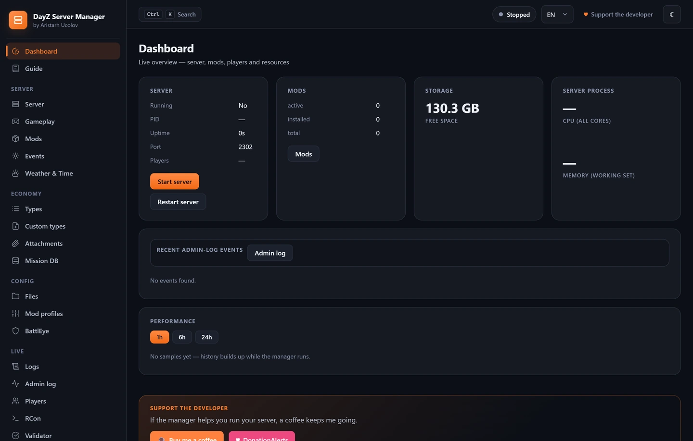
</p>

<table>
  <tr>
    <td width="50%">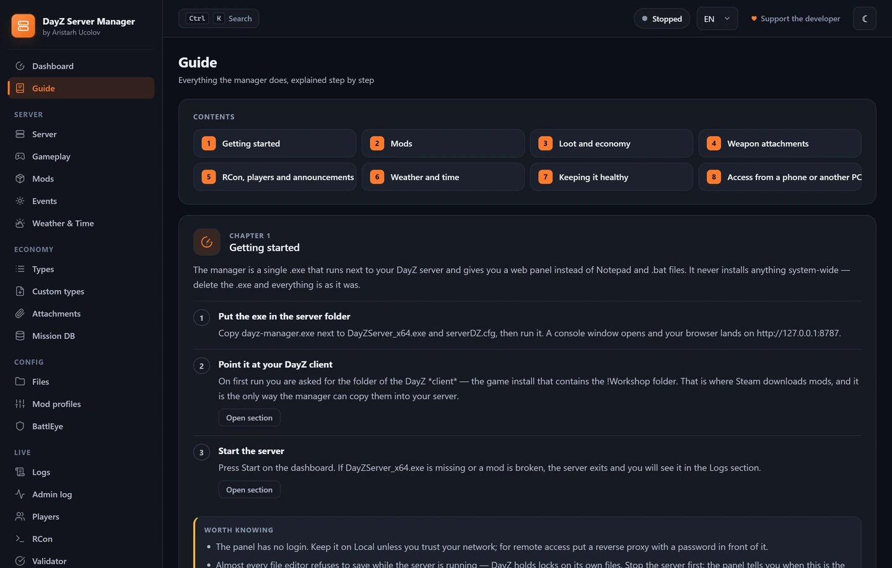<br>
      <b>Guide</b> — eight chapters of step-by-step explanations, each with a screenshot and a jump to the section it describes</td>
    <td width="50%">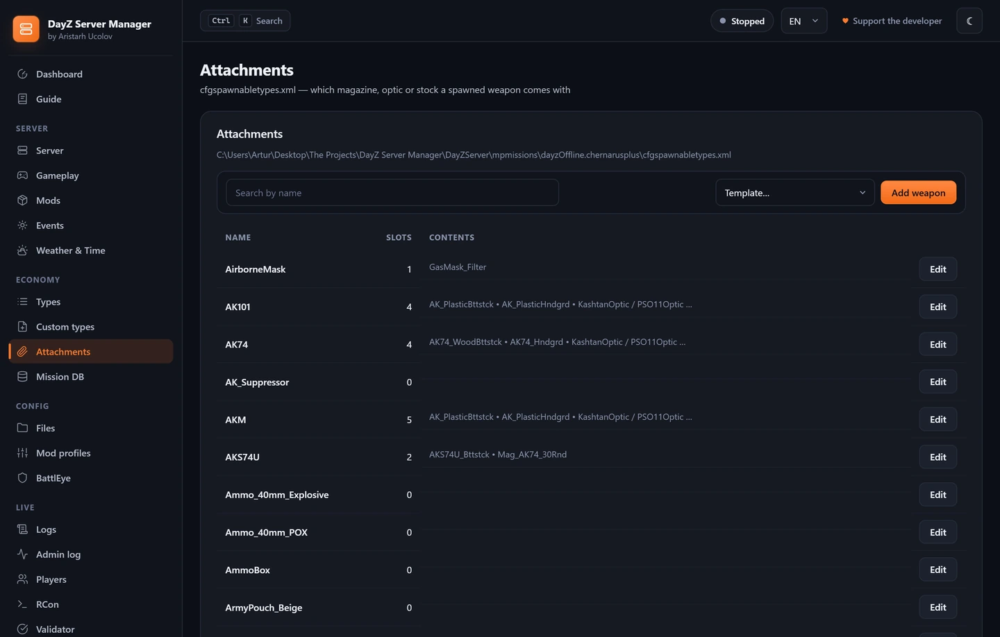<br>
      <b>Attachments</b> — cfgspawnabletypes.xml showing real spawn percentages instead of raw weights</td>
  </tr>
  <tr>
    <td>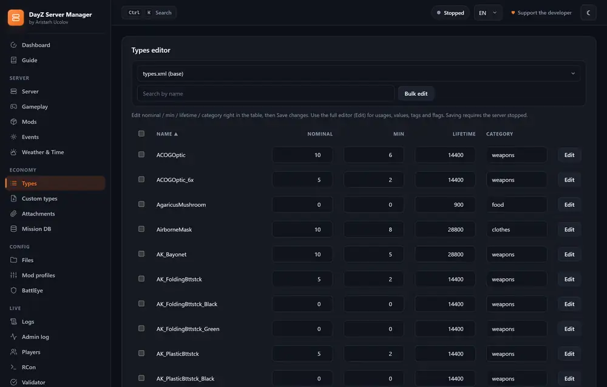<br>
      <b>Loot</b> — types.xml with search, in-table editing and bulk spawn presets</td>
    <td>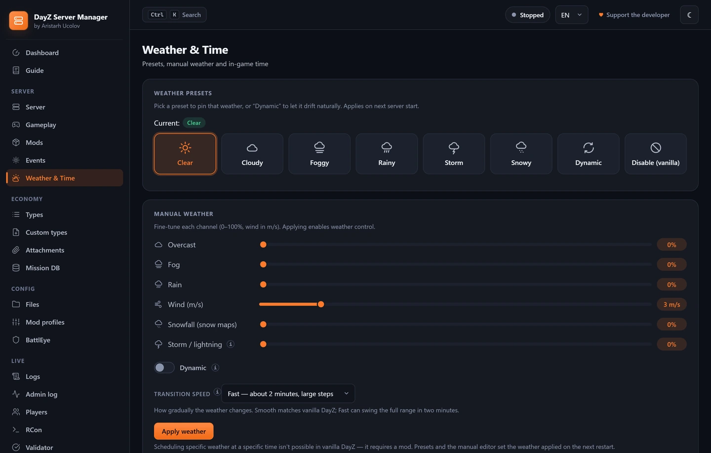<br>
      <b>Weather</b> — presets, manual tuning and transition smoothness</td>
  </tr>
  <tr>
    <td>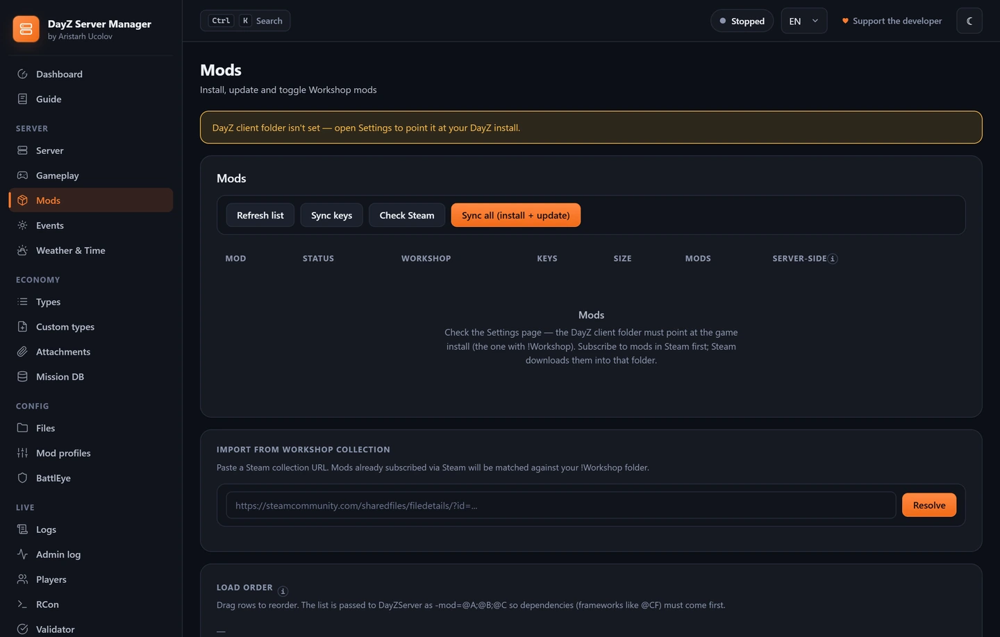<br>
      <b>Mods</b> — install from !Workshop, keys, load order, auto-update</td>
    <td>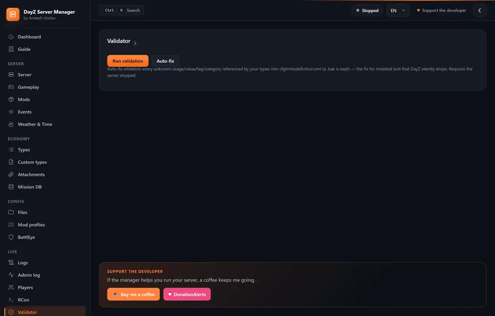<br>
      <b>Validator</b> — XML, cross-file references and value checks with auto-fix</td>
  </tr>
</table>

## What it does

- **Replaces the stock .bat launcher.** Same launch parameters (port,
  cpuCount, BEpath, profiles, -mod, -serverMod, dologs/adminlog/netlog/
  freezecheck, optional filePatching) plus an optional auto-restart loop on
  a configurable interval.
- **Mod install & update from Steam !Workshop.** Point the manager at
  your client DayZ install once — the UI then lists every `@Mod` Steam
  has downloaded. Hit **Install**: the mod is copied into the server dir
  and every `.bikey` is auto-copied into `keys/`. Hit **Update**: it
  re-syncs from Workshop **atomically** (new version is staged in a temp
  dir and only then swapped in, so a broken update can't corrupt the
  server). **Update all outdated** and **Sync all** bring the server dir in
  line with `!Workshop` in one click.
- **Mod auto-update.** Optionally refresh mods before every restart and
  poll `!Workshop` periodically — when a subscribed mod is newer there, the
  server updates and restarts with the usual countdown.
- **Watchdog.** If the server exits on its own, the manager brings it back
  up after 10 seconds. Crash-loop protection (3 exits in 5 minutes) pauses
  auto-restarts and shows a resume banner on the dashboard.
- **Discord notifications.** Server events (start, crash, restarts, mod
  updates, backups) are pushed to a Discord channel via webhook — in the
  panel's language.
- **Load order & server-side mods.** The `-mod=` order is drag-to-reorder
  (dependencies like `@CF` first). A separate toggle marks server-only mods
  (`-serverMod=`).
- **Smart uninstall.** When you remove a mod, keys in `keys/` are only
  deleted if **no other installed mod** provides the same `.bikey`.
  Shared signing keys (e.g. `dayzexpansion.bikey` used across CF /
  Core / AI) stay in place while any component is still installed.
- **server.cfg editor in the browser.** Preserves comments and `class`
  blocks on round-trip. One-field mission template changer — e.g. switch
  from `dayzOffline.chernarusplus` to `dayzOffline.enoch` instantly.
- **types.xml editor.** Searchable table with inline nominal / min /
  lifetime / category editing, plus a per-item editor for restock,
  quantmin/max, cost, flags, usages, values, tags.
- **Spawn presets.** Built-in presets (Military Tier 3/4, Civilian,
  Industrial, Hunting, Rare). Select a set of types → click a preset →
  its usage/value/tag and spawn fields merge into all selected types.
- **Events editor.** Spawn tables for zombies, vehicles and heli crashes:
  nominal/min/max/lifetime/restock plus child spawns.
- **Custom types (moded_types).** Create a new types file; the manager
  **auto-registers** it in `cfgeconomycore.xml`. You can also import
  `*_types.xml` straight out of an installed mod.
- **Attachments editor (cfgspawnabletypes.xml).** Define what a weapon
  spawns with — magazine, optic, buttstock, handguard — as slots with
  probabilities. The panel shows each item's **real spawn chance** (slot
  chance × weight ÷ total weight), which the raw XML makes very easy to
  misread. Ships templates for popular weapons (AKM, AK-74, AKS-74U, M4-A1,
  Mosin, SVD), autocompletes class names from your own `types.xml` (mods
  included) and flags classes missing from it — the usual reason an
  attachment never spawns.
- **Validator with auto-fix.** Scans every `.xml` under `mpmissions/`,
  checks brace balance in `.cfg`, verifies files referenced by
  `cfgeconomycore.xml` exist, flags duplicate types. **Auto-fix**
  whitelists unknown `usage/value/tag/category` into
  `cfglimitsdefinition.xml` (with a `.bak`) — the fix for modded loot DayZ
  otherwise silently drops.
- **RCon.** Player list, kick/ban, chat broadcast, raw command. Set the
  RCon password right in the panel — the manager writes it into
  `battleye/beserver_x64.cfg` (creating the file if needed).
- **Announcements & restarts.** Scheduled announcements (at a daily time)
  and interval announcements (every N minutes), plus scheduled daily
  restarts at HH:MM with an RCon countdown warning.
- **Weather & time.** Presets, a manual per-channel editor, day/night time
  acceleration and start time (`serverTime`).
- **Server wipe.** Clears saved world state (players, vehicles, bases,
  territories) — persistence folders are first moved to
  `.dayz-manager/wipes/<timestamp>/`, so a mistaken wipe can be restored.
- **Import an existing server.** Point at another server folder — the
  manager previews its mods / mission / serverDZ.cfg and lets you absorb
  what you want.
- **Logs & admin log.** View `.RPT`/`.ADM` with a tailing stream; parse
  admin-log events (connects, kills, chat) with filters.
- **Player database + killfeed.** The manager builds a persistent database
  from the admin log: names (with rename history), GUIDs, first/last seen,
  sessions, playtime, kills/deaths — plus a live killfeed with weapon and
  distance.
- **cfggameplay.json editor.** A form auto-generated from the file's own
  content (stamina, base building, world, UI) plus a raw-JSON mode with
  syntax validation; `enableCfgGameplayFile=1` is set automatically.
- **Performance charts.** Process CPU/memory and players online over time
  (1h/6h/24h) right on the dashboard.
- **Backup / restore.** Download a zip of `manager.json`, `serverDZ.cfg`,
  BE configs and mission files — or restore from one. Every overwrite of a
  DayZ file keeps a `.bak` (5 most recent). **Automatic backups**: the same
  zip on a schedule (every N hours) into `.dayz-manager/backups/` with
  rotation.
- **BattlEye bans editor.** A structured `bans.txt` table (GUID/IP,
  minutes, reason) instead of hand-editing; saving on a running server
  reloads bans via RCon `loadBans` — no restart needed.
- **Write-safety guard.** All file-writing endpoints return `409 Conflict`
  while the server is running (DayZ holds file locks on its working set).
  A warning banner is shown in the UI.
- **Why the server did not start.** While the server is down, the panel reads
  the newest RPT and its own log and shows the reason in plain words: a missing
  mod (named), an unsigned `.pbo`, a port already taken, a malformed
  `serverDZ.cfg`, an economy that failed to load. The raw log line is always
  shown — the matching is heuristic and the judgement stays yours. Nothing
  appears at all on a healthy server.
- **Diff before restore.** The panel has always kept a `.bak` beside every file
  it overwrites, but restoring one was blind. Each backup now has a Compare
  button showing exactly which lines would come back — fast even on a
  30 000-line `types.xml`.
- **Undo a wipe.** A wipe already *moved* the world folders into
  `.dayz-manager/wipes/<timestamp>/` rather than deleting them, precisely so it
  could be reversed. Now it can be, with one button — and the restore is
  refused, with an explanation, once the server has built new state, so the old
  world can never bury the new one.
- **Beginner's guide.** Eight chapters inside the panel: getting started,
  mods, loot and economy, attachments, RCon, weather, maintenance, remote
  access. Each has numbered steps, a screenshot of the section, a
  "worth knowing" box, and a button that opens the page it describes.
- **Hover help.** Key fields carry an "i" marker: hover it to read what
  `nominal` actually does, how `min` differs from it, why an attachment
  weight is not a percentage, and why a new RCon password only takes effect
  after a restart. Keyboard-reachable too.
- **Smooth weather transitions.** A transition-speed picker: Smooth
  (~30 minutes in small steps, like vanilla DayZ), Normal (~10 minutes) and
  Fast (~2 minutes). Earlier builds always wrote a two-minute ramp with
  full-range steps, which is what made weather feel like a light switch.
- **11-language UI** with an on-the-fly switcher: English, Русский, Español,
  Français, Deutsch, Italiano, Português, Moldovenească, 中文, 日本語, 한국어.
  A language picker in the first-run wizard.
- **Local, LAN or Internet exposure.** Default bind is `127.0.0.1`.
  Exposure is chosen in Settings; reachable URLs for phones/other devices
  are shown for you. There is no built-in login — use LAN mode only on a
  trusted network, or front it with an authenticating reverse proxy.

## Build

Requires Go 1.22+. (Pre-built binaries are on the GitHub Releases page.)

```bash
# from the project root — development build
go build -o dayz-manager.exe ./cmd/manager
```

Release build. `-s -w` drop the symbol table and DWARF debug info — about
3.4 MB that is never read at runtime. They do not affect behaviour or panic
tracebacks (Go takes function names and line numbers from `pclntab`, which
these flags leave alone), so a crash report from a user is just as detailed.
**The binaries on GitHub Releases are built this way** — use this command for
releases or the exe grows by a third:

```bash
go build -ldflags="-s -w" -o dayz-manager.exe ./cmd/manager
```

Cross-compiling to Windows from Linux/macOS:

```bash
GOOS=windows GOARCH=amd64 go build -ldflags="-s -w" -o dayz-manager.exe ./cmd/manager
```

**Icon and file properties.** `cmd/manager/resource_windows_amd64.syso` is
committed and `go build` links it automatically — no tooling to install.
Regenerate it only when the icon or the version changes:

```bash
go install github.com/josephspurrier/goversioninfo/cmd/goversioninfo@latest
# after editing the version in cmd/manager/versioninfo.json:
goversioninfo -icon=cmd/manager/icon.ico -o cmd/manager/resource_windows_amd64.syso cmd/manager/versioninfo.json
```

The version in `versioninfo.json` is not tied to `appVersion` in `main.go` —
bump both on release, or Properties → Details will show the old number.

The resulting binary is fully self-contained — the web UI is embedded via
`//go:embed`. No Node.js, no runtime deps.

### Usage

1. Copy `dayz-manager.exe` into your DayZ Server folder
   (next to `DayZServer_x64.exe` and `serverDZ.cfg`).
2. Double-click it. A console window opens and your browser launches
   `http://127.0.0.1:8787/`.
3. On first run, enter the path to your *client* DayZ install (the one
   with the `!Workshop/` folder), pick a language, and choose `Local` or
   `LAN/Internet` exposure.
4. Use the panel. **Stop the server** before editing files.

### Command-line flags

| flag           | default          | meaning                                             |
|----------------|------------------|-----------------------------------------------------|
| `-port`        | `8787`           | Web panel port.                                     |
| `-bind`        | *(from settings)* | Bind address. Blank = follows exposure: `127.0.0.1` for Local, `0.0.0.0` for LAN. |
| `-no-browser`  | `false`          | Don't auto-open the browser on start.               |
| `-version`     | —                | Print version and exit.                             |

### Running as a Windows Service (NSSM)

For unattended hosting, run the panel as a service with
[NSSM](https://nssm.cc/):

```bat
nssm install DayZManager "C:\DayZServer\dayz-manager.exe"
nssm set DayZManager AppDirectory "C:\DayZServer"
nssm set DayZManager AppParameters "-bind 0.0.0.0 -no-browser"
nssm set DayZManager Start SERVICE_AUTO_START
nssm start DayZManager
```

The panel will be reachable at `http://<server>:8787/` right after Windows
boots. The panel has **no built-in login** — when exposing it to LAN /
Internet, put Caddy / nginx with HTTP Basic auth in front.

## REST API (summary)

- `GET  /api/info` — app info
- `GET  /api/i18n` — string bundle + language list
- `GET  /api/config` · `POST /api/config` — manager config
- `POST /api/config/finish-first-run` — first-run wizard submission
- `GET  /api/server/status` — PID / uptime / port / running
- `POST /api/server/{start|stop|restart}`
- `GET  /api/servercfg` · `POST /api/servercfg` — read & write kv block
- `POST /api/servercfg/mission` — change mission template
- `GET  /api/mods` — Workshop + installed
- `POST /api/mods/{install|uninstall|update|update-all|sync-all|sync-keys|enable|order}`
- `GET  /api/types?file=...` · `GET /api/types/item` · `POST /api/types/bulk-patch`
- `GET  /api/types/presets` · `POST /api/types/apply-preset`
- `GET  /api/events` · `GET /api/moded` · `POST /api/moded/{create|delete}`
- `GET  /api/validate` · `POST /api/validate/fix`
- `GET  /api/rcon/players` · `POST /api/rcon/{say|kick|ban|command}`
- `GET  /api/weather` · `POST /api/weather/{preset|custom|time}`
- `GET  /api/wipe/preview` · `POST /api/wipe`
- `GET  /api/logs/{list|read|stream}` · `GET /api/admlog/recent`
- `GET  /api/backup/export` · `POST /api/backup/import`
- `GET  /api/files/tree?path=...` · `GET /api/files/read?path=...` · `POST /api/files/write`

All write endpoints return `409 Conflict` if the DayZ server is currently
running.

## License

Copyright © 2026 Aristarh Ucolov. All rights reserved. See
[LICENSE.md](LICENSE.md).
